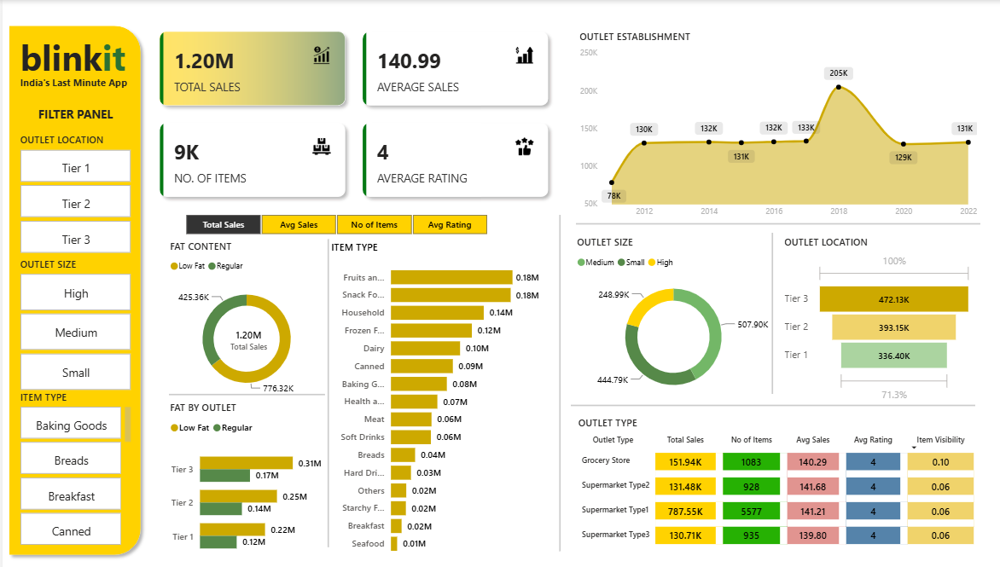

# 📊 Blinkit Grocery Sales Analysis – Power BI Dashboard


A complete data analysis project using **Power BI** to study Blinkit’s grocery sales performance, customer behavior, and outlet efficiency.


# 📁 Project Overview

This project analyzes Blinkit’s grocery sales data to uncover:

- Sales patterns  
- Item-type performance  
- Outlet-wise insights  
- Location & size impact  
- Fat content influence  
- Customer satisfaction metrics  

# 🎯 Business Requirement

To perform a comprehensive analysis of Blinkit’s sales performance, customer satisfaction, and inventory distribution using KPIs and Power BI visualizations.


# 📊 Dataset Overview

The dataset includes:

- Item type  
- Fat content  
- Sales amount  
- Item visibility  
- Outlet size  
- Outlet location  
- Establishment year  
- Ratings  


# 🧹 Data Cleaning (Power Query)

Only one major cleaning step was required:

### **Standardizing Item Fat Content**
- `LF`, `low fat` → **Low Fat**  
- `reg` → **Regular**

This ensured consistent grouping during analysis.


# 🧮 DAX Measures

```dax
-- Total Sales
Total Sales =
SUM('Blinkit'[Sales])

-- Average Sales
Average Sales =
AVERAGE('Blinkit'[Sales])

-- Number of Items
Number of Items =
DISTINCTCOUNT('Blinkit'[Item_ID])

-- Average Rating
Average Rating =
AVERAGE('Blinkit'[Rating])
```


# 📌 KPI Requirements

- **Total Sales** – Overall revenue  
- **Average Sales** – Revenue per sale  
- **Number of Items** – Total unique items sold  
- **Average Rating** – Customer satisfaction  


# 📈 Chart Requirements

### **1. Total Sales by Fat Content**  
- Objective: Analyze fat content impact  
- Chart: Donut Chart  

### **2. Total Sales by Item Type**  
- Objective: Category performance  
- Chart: Bar Chart  

### **3. Fat Content by Outlet**  
- Objective: Compare fat content sales across outlets  
- Chart: Stacked Column Chart  

### **4. Total Sales by Outlet Establishment Year**  
- Objective: Study impact of outlet age  
- Chart: Line Chart  

### **5. Sales by Outlet Size**  
- Objective: Analyze size-wise performance  
- Chart: Donut/Pie Chart  

### **6. Sales by Outlet Location**  
- Objective: Location-based performance  
- Chart: Funnel Map  

### **7. All Metrics by Outlet Type**  
- Objective: KPI comparison by outlet type  
- Chart: Matrix Card  


# 🖥️ Dashboard Preview




# 🔍 Insights Generation


### **1. Regular Items Outsell Low-Fat Items**  
Regular products contribute more revenue.

### **2. Fruits & Vegetables & Snack Foods Perform Best**  
Top-selling categories; seafood & breakfast items underperform.

### **3. Tier 3 Locations Generate Highest Sales**  
Strong demand in Tier 3 markets.

### **4. Medium-Sized Outlets Show Highest Sales**  
Indicates ideal outlet structure.

### **5. Outlets Established Between 2018–2020 Perform Best**  
Peak sales around 2018.

### **6. Supermarket Type 1 & Grocery Stores Lead**  
These outlet types have the highest total sales.

### **7. Average Rating ~4 Shows High Satisfaction**  
Customers are generally satisfied.

### **8. Fat Content Performance Varies by Outlet**  
Indicates different customer preferences by region.

### **9. Higher Item Visibility = Higher Sales**  
Placement strategy affects sales.

### **10. Majority of Revenue Comes from Top Categories**  
Sales are concentrated in high-demand items.


# 🛠 Tools Used

- Power BI Desktop  
- Power Query  
- Microsoft Excel  
- DAX (Data Analysis Expressions)  


# 📂 Project Files

- Blinkit Sales Analysis.pbix  
- Blinkit Dataset.xlsx  
- Report.pdf  
- README.md  


# 📌 Conclusion

This Power BI project provides clear and actionable insights into Blinkit’s sales performance, helping identify business opportunities, customer preferences, and improvement areas.


